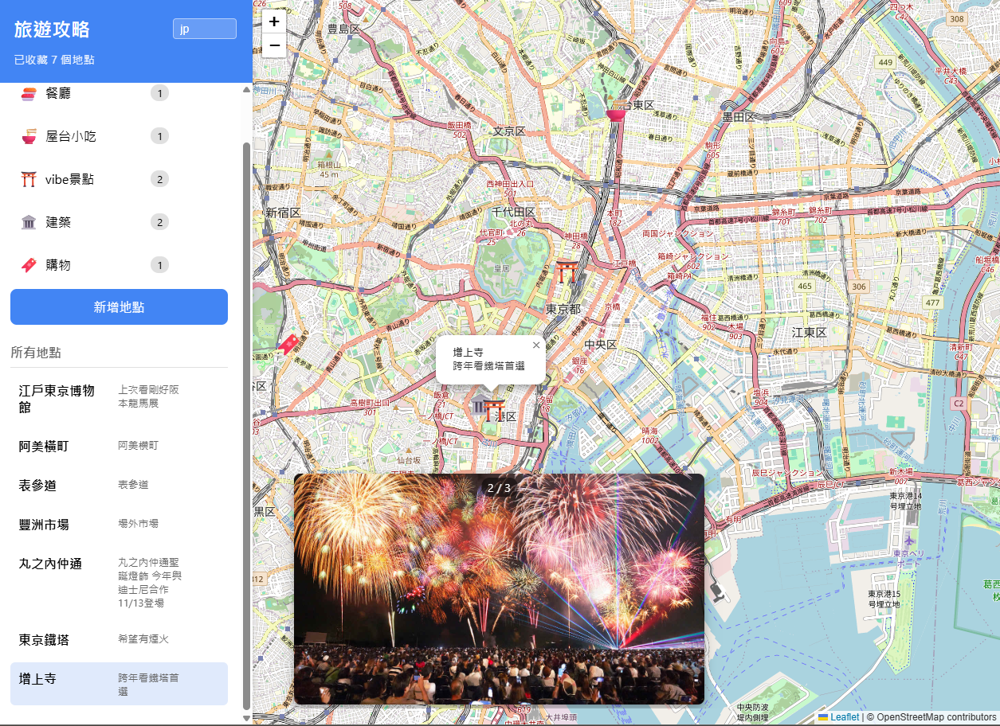

# MaxTraveler - 您的個人旅遊規劃助手

MaxTraveler 是一個輕量級的網頁應用程式，旨在幫助您輕鬆規劃和管理您的旅行地點。無論是餐廳、景點還是購物點，您都可以將它們標記在地圖上，並透過群組進行分類，甚至為每個地點上傳照片。

## 功能特色

- **地點管理**：新增、編輯和刪除您的旅行地點，包含名稱、地址和詳細資訊。
- **地圖整合**：使用互動式地圖顯示所有地點，支援拖曳標記更新位置。
- **群組分類**：建立自訂群組（例如：餐廳、景點、購物）來組織您的地點。
- **照片上傳**：為每個地點上傳多張照片，並透過內建的圖片輪播器瀏覽。
- **本地儲存**：所有資料都儲存在您的瀏覽器中，確保您的隱私和快速存取。
- **響應式設計**：簡潔的介面，提供良好的使用者體驗。

## 如何使用

1.  **新增地點**：點擊「新增地點」按鈕，輸入地址（支援智慧搜尋），選擇群組，並可上傳照片。
2.  **編輯地點**：點擊地點列表中的鉛筆圖示，即可編輯地點資訊。
3.  **瀏覽照片**：點擊地圖上的標記或地點列表中的項目，若有上傳照片，將會開啟圖片輪播器。
4.  **管理群組**：您可以新增、編輯或刪除自訂群組。

## 效果展示

## 技術棧

- HTML5
- CSS3
- JavaScript
- Leaflet.js (地圖庫)
- OpenStreetMap (地圖資料)

## 開發與貢獻

歡迎任何形式的貢獻！如果您有任何建議或發現錯誤，請隨時提出。